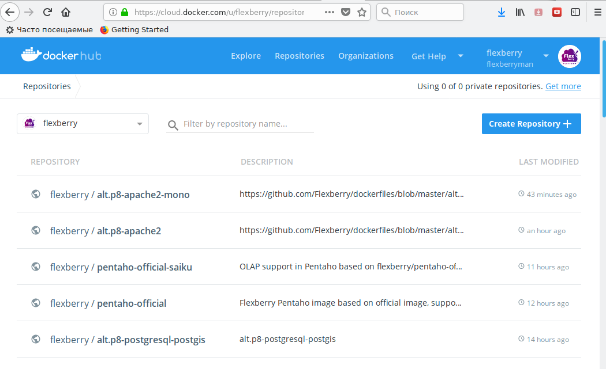

## Конфигурирование автосборки

### Создание репозитория (docker-образа)

Английская документация находится [по ссылке](https://docs.docker.com/docker-hub/repos/).

Зарегистрируйтесь, перейдите на страницу списка репозиториев:
https://cloud.docker.com/u/flexberry/repository/list



и кликните клавишу `Create Repository`.


На открывшемся интерфейсе введите имя репозитория - имя образа после префикса `flexberry/` (например `alt.p8-nginx`).
Кликните клавишу `Create`. 

В новом интерфесе репозитория (`flexberry/alt.p8-nginx`) введите краткое и полное описание репозитория (docker-образа).
Кликните клавишу `Update`.


После обновления кликните вкладку `Builds`.


В интерфейсе `Builds` кликните клавишу `Configure Automated Build`.

В открывшемся интерфейсе выберите (если необходимо) github-проект `Flexberry` и в выпадающем меню репозиторий в котором находится Ваш `Dockerfile` и (под)директорий сборки образа (например `dockerfiles`).


 
 В открывшемся интерфейсе замените стандартный шаблон `Branch/master` на шаблон по тегу:
- В поле `Source Type` выберите `Tag`.
- В поле `Source` укажите шаблон git-тега по которому будет происходит автосборка образа:

  ```
  ^alt.p8-nginx_1.14.2-([0-9]+).([0-9]+).([0-9]+)$/
  ```
  
    Где:
    * `/^` - начало шаблона;
    *  `alt.p8-nginx` - имя образа без префикса `flexberry/`;
    * `_` - разделитель между именем образа и `git-`, `docker-тегом`;
    * `1.14.2` версия сервиса `nginx` (для собственных образов отсутсвует);
    *  `-` - разделитель версии сервиса и версии сборки (для собственных образов отсутствует);
    * ([0-9]+).([0-9]+).([0-9]+) - шаблон версии сборки - три числа x.y.z (МАЖОР, МИНОР, ПАТЧ), разделенные точками;
    * `$/` - конец шаблона.
    
- В поле `Docker Tag` укажите список формируемых Docker-тегов:
  
  ```
  1.14.2-{\1}/{\2}.{\3}, latest
  ```  
  
  Где первый тег::
  * `1.14.2` - версия сервиса `nginx` (для собственных образов отсутствует);
  * `-` - разделитель версии сервиса и версии сборки (для собственных образов отсутсвует);
  * `{\1}/{\2}.{\3}` - правило формирования версии сборки  из шаблона - x.y.z (МАЖЛР, МИНОР, ПАТЧ)
  
  второй тег - `latest`.

- В поле `Docker Location` оставьте строку `Dockerfile`.

- В поле `Build Context` укажите директорий, где находится файл `Dockerfile` и среда для сборки образа (вспомогательные файлы для копирования в создаваемый образ).
  Это может быть корневой директорий (`/`) или любой поддиректорий git-репозитория где находится `Dockerfile`.

 
  
 
 

 Source Type | Source | Docker Tag | Docker Location | Build Context 
-------------|--------|------------|-----------------|---------------
Tag | ^alt.p8-nginx_1.14.2-([0-9]+).([0-9]+).([0-9]+)$/ | 1.14.2-{\1}/{\2}.{\3}, latest | Dockerfile | /alt.p8-nginx/


Вы можете сконфигурировать дополнительные шаблоны для других версий сервиса.
Например, для образа с версией `nginx `1.15.9`:

Source Type | Source | Docker Tag | Docker Location | Build Context 
-------------|--------|------------|-----------------|---------------
Tag | ^alt.p8-nginx_1.14.2-([0-9]+).([0-9]+).([0-9]+)$/ | 1.14.2-{\1}/{\2}.{\3}, latest | Dockerfile | /alt.p8-nginx/ 
Tag | ^alt.p8-nginx_1.15.9-([0-9]+).([0-9]+).([0-9]+)$/ | 1.15.9-{\1}/{\2}.{\3}, latest | Dockerfile | /alt.p8-nginx/

или задать единственный универсальный шаблон (в этом случае меняется формат поля `Docker Tag`):

Source Type | Source | Docker Tag | Docker Location | Build Context 
-------------|--------|------------|-----------------|---------------
Tag | ^alt.p8-nginx_([0-9.]+)-([0-9]+).([0-9]+).([0-9]+)$/ | {\1}-{\2}/{\3}.{\4}, latest | Dockerfile | /alt.p8-nginx/ 
 

После конфигурирования кликните кнопку `Save`. Отобразятся заданные параметры конфигурации:

  
 
 
 ### Запуск автосборки
 
 Запуск автосборки состоит из следующих шагов:
 
 
- Перейдите в корневой директорий репозитория (`.../alt.p8-nginx/`);
 
- Переключитесь, если необходимо, на нужную Вам ветку:
   
```
$ git checkout <имя_ветки>
``` 
   
- Добавьте тег:
   
```
$ git tag <имя тега>
```
   
Например:
   
```
$ git tag alt.p8-nginx_1.14.2-0.5.0
```
   
* Передайте созданный тег в на `github.com:`
   
```
$ git push --tags
```

### Мониторинг автосборки 

Вернитесь в браузере в закладку `Builds`  и перегрузите страницу.
В списке `Recent Builds` появится задача на автосборку:


Кликните на вашу задачу для отображения ее состояния.


Первоначально задача устанавливается в состояние `PENDIND` (Ожидание).
По истечении определенного интервала (в зависимости от времени суток от нескольких минут до нескольких часов)
задача переводится в состояние `RUNNING`, копируется github-репозиторий в состоянии заданного тега (становится активна закладка `Dockerfile`) и производится автосборка образа.

По окончании автосборки в зависимости от результата задача переводится в состояние `SUCCESS` или `ERROR`
(состояние в браузере динамически не обновляется - требуется перезагрузка окна).


В закладке `Tags` можно посмотреть список сформированных тегов для образа.


## Добавление дополнительных алиасов собранного образа

Механизм публикации образов при автосборке имеет один существенный недостаток:
при первоначальной генерации и публикации образов по шаблону
```
1.14.2-{\1}/{\2}.{\3}, latest
```
с git-тегом `alt.p8-nginx_1.14.2-0.5.1` в репозиторий будут опубликован образ
`flexberry/alt.p8-nginx:1.14.2-0.5.1` с алиасом
`flexberry/alt.p8-nginx:latest`.

При повторной  генерации и публикации образов по шаблону
с git-тегом `alt.p8-nginx_1.14.2-0.5.2`
будет опубликован образ `flexberry/alt.p8-nginx:1.14.2-0.5.2`
но, так как образ `flexberry/alt.p8-nginx:latest` уже существует 
он не будет обновлен и останется алиасом образа 
`flexberry/alt.p8-nginx:1.14.2-0.5.1`.

Обойти эту проблему можно только с использованием 
[механизма `hook`ов](https://docs.docker.com/docker-hub/builds/advanced/#custom-build-phase-hooks).
путем создание скриптов: 
- [hooks/pre_push](alt.p8-nginx/hooks/pre_push) - создание алиасов образа;
- [hooks/post_push](alt.p8-nginx/hooks/post_push) - передача алиасов образов в репозиторий `hub.docker.com`.

Скрипт `hooks/pre_push` до размещения сгенерированного образа генерирует имена алиасных образов
```
flexberry/alt.p8-nginx:1.14.2-0.5
flexberry/alt.p8-nginx:1.14.2-0
flexberry/alt.p8-nginx:1.14.2
flexberry/alt.p8-nginx:latest
``` 
После размещения основного созданного образа скрипт `hooks/post_push` 
публикует fkbfcs в репозитории 
>Тег `latest` в поле `Docker tag` интерфейса `Automated build` в этом случае необходимо убрать.

Итоговые список тегов:


 


