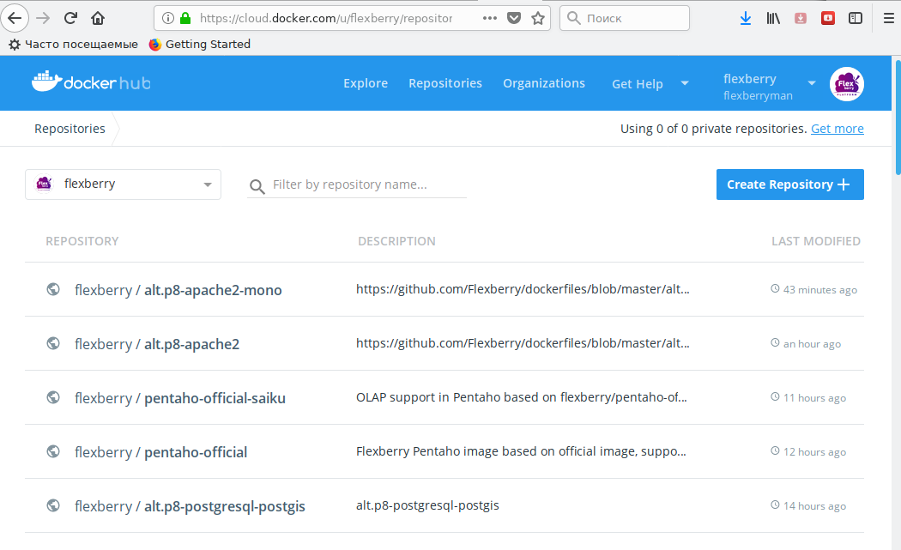
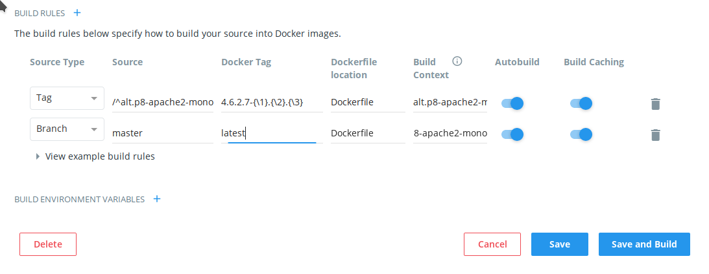

## Основные сведения

Автосборка образов производится на сервисе https://cloud.docker.com/u/flexberry.

Он позволяет настраивать hook'и которые при наступлении определенных событий в указанном github.com репозитории запускать процесс атоматической сборки (и, при необходимости, тестировния) 
docker-образов.

Автосборка может быть настроена на два типа событий:
- обновление ветки репозитория;
- добавление тега в репозиторий.

Если указанное событие соответствует шаблону автосборки запускается процесс сборки образа и в случае успешной сборки  (и, при необходимости, тестировния) 
размещает его в репозиториий https://hub.docker.com.

Для наших условий (необходимость оуществлять автосборку различных образов в одном репозитории) наиболее удобным является механизм автосборки по событиям добавления новых тегов в репозиторий.
В дальнейшем речь пойдет именно об этом режиме.
