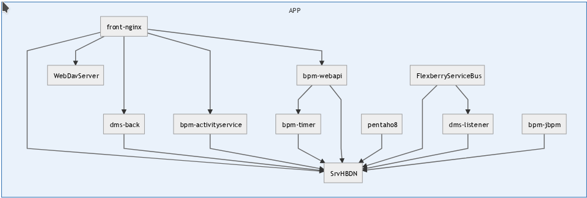
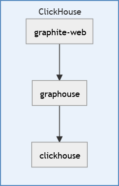

# readycheck - Описание скрипта readycheck и способы его использования в сервисах docker-compose

## Общее описание

Скрипт обеспечивает ожидание появления доступа к заданным URL. После того как доступ ко всем URL появился скрипт прекращает свою работу и заканчивается с кодом завершний 0.

Скрипт требует наличия программы curl

Экспортируемые переменные:

* `READYCHECK_URLS` - Список `URLS` через пробел
 
    Format `URL`:
    <pre>
    IP:PORT
    SERVICENAME:PORT
    http://IP:PORT/[...]
    HTTP://IP:PORT/[...]
    http://SERVICENAME:PORT/[...]
    HTTP://SERVICENAME:PORT/[...]
    https://IP:PORT/[...]
    HTTPS://IP:PORT/[...]
    https://SERVICENAME:PORT/[...]
    HTTPS://SERVICENAME:PORT/[...]
    </pre>
    Согласно предоставленному списку URL он проверяет наличие указанных открытых портов:

    - протоколы `http`, `https` (форматы `http://IP:PORT/[...]`, `HTTP://IP:PORT/[...])`, `http://SERVICENAME:PORT/[...]`, `HTTP://SERVICENAME:PORT/`, `https://IP:PORT/[...]`, `HTTPS://IP:PORT/[...]`, `https://SERVICENAME:PORT/[...]`, `HTTPS://SERVICENAME:PORT/[...]`  :
    
        Для протокола `http` и `https`  проверяется наличие в первой строке ответа:  
        <pre>
        HTTP/N CODE
        </pre>
        - Если имя протокола в `URL` написно заглавными буквми (`HTTP`, `HTTPS`) код завершения запроса  (`CODE`) должен быть `< 400`
        - Если прописными (`http`, `https`) - код завершения запроса не проверяется
        
    - остальные протоколы (формат `SERVICENAME:PORT`, `IP:PORT`)
    
        Для остальных протоколов (psql, ...) проверяется только наличие готового отвечающего порта.

    Если порт недоступен или код завершения неверный сканирование дальнейших `URL` в списке прекращается и через `READYCHECK_TIMEOUT` производится тестирование указанных `URLs` с начала.

    Пример:
        <pre>
        READYCHECK_URLS="SrvHBDN:5432 10.130.5.176:55555 http://front-nginx/ HTTPS://front-nginx/"
        </pre>

* READYCHECK_TIMEOUT - Таймаут между проверками списка `URL`S - по умолчанию `5` секунд

При сборке образа скрипт необходимо:

* скопиовать в среду образа командой:
<pre>
COPY readycheck /bin/
</pre>

* вставить в инстркцию `CMD` `Dockerfile` до вызова основной команды:
<pre>
CMD readycheck && &lt;ОСНОВНАЯ_КОМАНДА_ОБРАЗА&gt;
</pre>

Посмотреть вызов основной команды базового образа (инструкция `FROM` в `Dockerfile`) можно командами:
<pre>
docker inspect &lt;имя_образа&gt; | jq '.[].Config.Cmd' 
</pre> 

Например:
<pre> 
$ docker inspect  dh.ics.perm.ru/zs-dms-ose/dms-front:latest   | jq '.[].Config.Cmd'
[
  "nginx",
  "-g",
  "daemon off;"
]
 
</pre>  

## Примерение скрипта в поставленной задаче [Запуск докер-сервисов из стека сервисов в заданном порядке](https://gitlab.flexberry-foundation.ru/infrastructure/public/-/issues/225061)

В предоствленном файле [docker-compose.yml](docker-compose_orig.yml) наблюдалось два дерева зависимостей между сервисами:

 

Так как сервисы стартуют в случайном порядке и при запуске одного сервиса сервис от которого он зависит еще может не запуститься и его имя в DNS еще не анонсироваться, использование имен сервисов в файлах конфигурации образов и в экпортируемых переменных содержащих URL было невозможно.

Вынужденным выходом из этой ситуации был проброс внутренних портов зависимых сервисов наружу на порты HOST системы с назначением им  заранее оговоренных портов.
Это решало задачу доступа к сервисам, но создавало проблемы:

- усложнение `docker-compose.yml` - приходилось добавлять проброс портов наружу и указывать в файлах конфигурации образов и экспортируемых переменных не имена сервисов, а IP-адрес HOST-компьютера;
- потеря универсальности системы - при выкатке системы на `PROD` приходилось полностью менять IP-адреса и возможно (при конфликте портов) и порты в URL;
- потеря безопасности - проброс внутренних портов включая порты баз данных наружу

Использование скрипта `readycheck` позволило:

- упростить `docker-compose.yml` - для внутренних сервисов проброс портов не нужен, в файлах конфигурации образов и экспортируемых переменных указываются имена сервисов, порты `80`, `443` в `URL` можно не указывать.
- `docker-compose.yml` становится более универсальным - при переносе на `PROD` удаляются только внешние сервисы, порты и `URL` не модифицируются.
- повышается безопасность - порты внутренних сервисов включая базы данных становятся недоступными снаружи.

### Модификация образов

Так как поддержка `readycheck` требует добавление скрипта в образы и модификации файлов конфигурации, то для образов сервисов, которые  зависят от других сервисов были модифицированы образы.
Модификация заключалась в создании на основе исходного образа дочерних с добавлением тропы `readycheck` в имя образа:

* dh.ics.perm.ru/zs-dms-ose/bpm-activityservice -&gt; dh.ics.perm.ru/zs-dms-ose/readycheck/bpm-activityservice;
* dh.ics.perm.ru/zs-dms-ose/dms-back -&gt; dh.ics.perm.ru/zs-dms-ose/readycheck/dms-back;
* и т.д.

В директории `images` были созданы поддиректории для Dockerfile's куда включались копии скрита `readyckeck` и при необходимости файлы конфигурации.

Список каталогов сборки образов:

* [bpm-activityservice](./images/bpm-activityservice);
* [bpm-jbpm](./images/[bpm-jbpm); 
* [bpm-timer](./images/bpm-timer); 
* [dms-back](./images/dms-back); 
* [dms-listener](./images/dms-listener); 
* [esb](./images/esb); 
* [front-nginx](./images/front-nginx); 
* [graphite-web](./images/graphite-web); 
* [graphouse](./images/graphouse); 
* [pentaho8](./images/pentaho8); 
* [web-api](./images/web-api).

`Dockerfile` состоит из:
 
- указания базового  образа (`FROM ...`);
- в славе отсутствия команды `curl` в базово образе - установка ее через `apt-get install -y curl`;
- команды `COPY readycheck /bin/readycheck`;
- команды `CMD readycheck && &lt;стартовая_команда_образа&gt;`

Посмотреть вызов основной команды базового образа (инструкция `FROM` в `Dockerfile`) можно командами:
<pre>
docker inspect &lt;имя_образа&gt; | jq '.[].Config.Cmd' 
</pre> 

Например [bpm-activityservice/Dockerfile](./images/bpm-activityservice/Dockerfile).

Для части образов с измененными файлами конфигурации они были включены в поддиректории и в `Dockerfile` добавлена команда их копирования.
Например:  [front-nginx/Dockerfile](./images/front-nginx/Dockerfile).

Для автоматической сборки образов был написан скрипт [rebuild.sh](./images/rebuild.sh) который:

* обходит все или указанные поддиректории с `Dockerfile`;
* определяет имя формируемого образа с подтропой `.../readycheck/...`
* линкует в поддиректорий скрипт `readycheck`;
* собирает образ.

### Модификация docker-compose.yml

В [dockercompose.yml](./[dockercompose.yml) для зависимых сервисов были произведены следующие изменения:

* Изменены имена образов на собранные образы с подтропой `readycheck`;
* В `environment` добавлена переменная `READYCHECK_URLS` с описанием зависимых `URLS` (обратите внимание - использованы **имена сервисов** и **внутренние порты `80`,`443`**, ...).
* Изменены в переменных `environment` `URL` на внешний IP HOST-сервера и порты сервисов на внутренние имена сервисов и внутренние порты.
* Для внутренних сервисов удалены (закомментированы) пробросы внутренних портов сервисов на внешние.

<pre> 
  front-nginx:
    image: dh.ics.perm.ru/zs-dms-ose/readycheck/dms-front:${TAG}
    ...
    environment:
      - READYCHECK_URLS=SrvHBDN:5432 http://IdentityServer http://WebDavServer http://dms-back http://bpm-activityservice http://bpm-activityservice http://template-collection
      ...
</pre>

## Результаты

В результате применения скрипта:

* Обеспечена синхронизация запуска сервисов. Скрипт `readycheck` дожидается подъема всех зависимых сервисов и определения из DNS-имен в DNS_сервере стека сервисов. В момент окончания скрипта `DNS` всех зависимх сервисов определен и файлах конфигурации сервисов в `URL` можно (и нужно) использовать имена сериисов.

* Файл `docker-compose.yml` стал более универсальным. Необходимы минимальные изменения при его переносе в другие среды.

* Повышена безопасность решения за счет отсутствия проброса внутренних портов наружу. 

