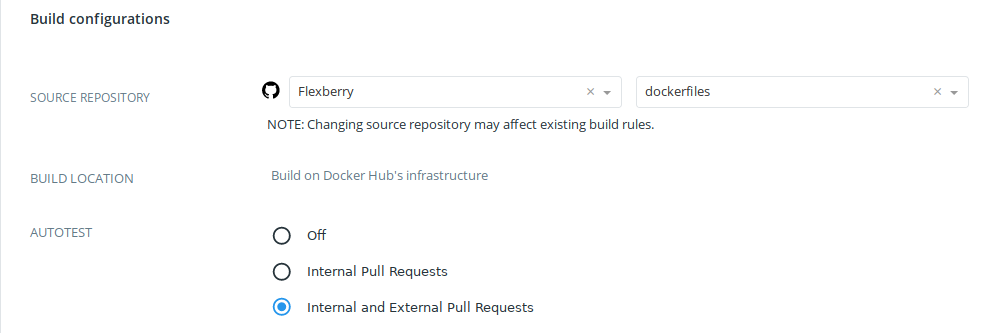

## Тестирование образов

### Описание тестовых файлов

#### docker-compose ...yml файлы

Для тестирования образов создайте в каталоге сборки образа (`Build Context`) один (по умолчанию `docker-compose.test.yml`) 
или несколько файлов с суффиксом `.test.yml`(https://docs.docker.com/docker-hub/builds/automated-testing/).

В списке сервисов YML-файла должен присутсвовать сервис тестирования:
```
sut:
  build: .
  command: <test_скрипт>
```
Оператор 
```
build .
```
обеспечивает согласно `Dockerfile` сборку тестирования образа.

Оператор:
```
command: <test_скрипт>
```
обеспечивает запуск тестирующего скрипта. Данный скрипт должен быть скопирован в образ в `Dockerfile`.
При успешном завершении тестирования образа скипт должен возвратить нулевой код завершения.
В этом случае собранный образ размещается в итоговом репозитории `hub.docker.com`.

#### Пример тестирования 

Рассмотрим описание тестирования для образа `flexberry/alt.p8-nginx`.

Файл тестирования `docker-compose.test.yml`:
```
version: '3.2'

services:
  sut:
    build: .
    command: /bin/testNginx.sh
```

Скрипт тестирования `bin/testNginx.sh`:
```
#!/bin/sh
set -x
/usr/sbin/nginx &
sleep 10;
/usr/bin/wget http://localhost;


```

Файл описания сборки `Dockerfile`:
```
FROM flexberry/alt.p8

ENV LANG ru_RU.UTF-8

MAINTAINER mail@flexberry.ru

RUN \
  bzip2 -d /var/lib/rpm/*.bz2; \
  apt-get update && \
  apt-get install -y nginx; \
  mkdir -p /var/www/html; \
  echo "<html><body>test</body></html>" > /var/www/html/index.html; \
  echo "daemon off;" >> /etc/nginx/nginx.conf; \
  cd /etc/nginx/sites-enabled.d/; sed -i -e 's/localhost:80/*:80/' ../sites-available.d/default.conf; ln -sf ../sites-available.d/default.conf .; \
  rm -f /var/cache/apt/archives/*.rpm /var/cache/apt/*.bin /var/lib/apt/lists/*.*; \
  bzip2 -9 /var/lib/rpm/*

COPY testNginx.sh /bin
  
CMD /usr/sbin/nginx
```

Обратите внимание. В  образе оператором `CMD` запускается сервис `/usr/sbin/nginx`. 
При тестиовании данный оператор замещается запуском тестоового скрипта `/bin/testNginx.sh`.
Поэтому запуск сервиса 'перекладывается' на сам сервис тестирования:
```
/usr/sbin/nginx &
```

### Активация тестирования в репозитории

На вкладке `Builds` (Build configuration) включите режим `Internal and external pull requests` и нажмите клавишу 
`Save`.


